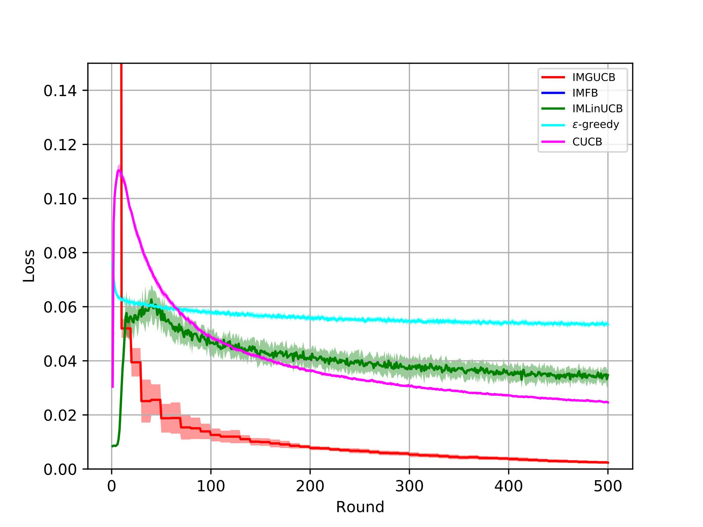
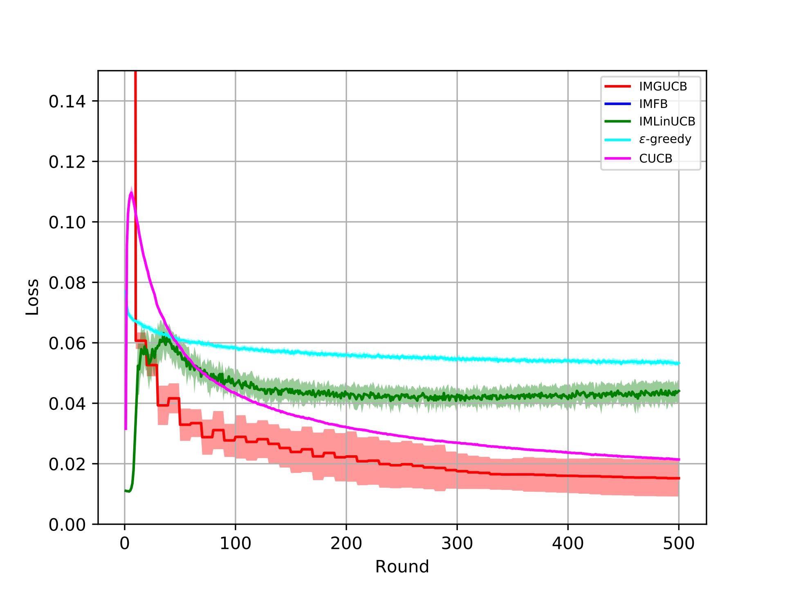
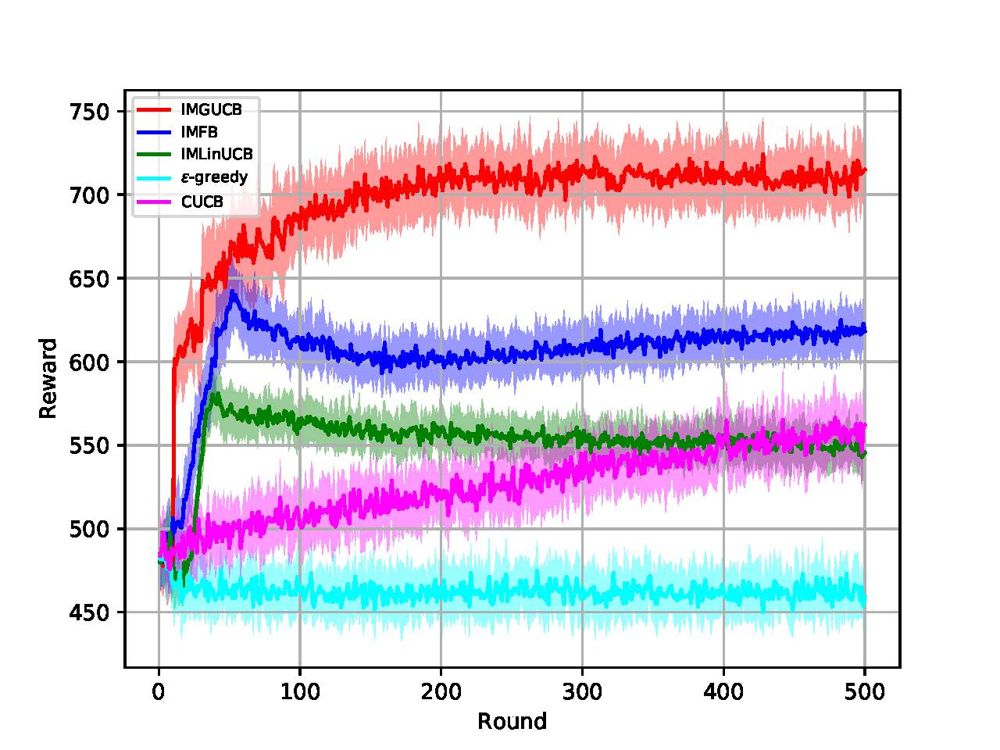
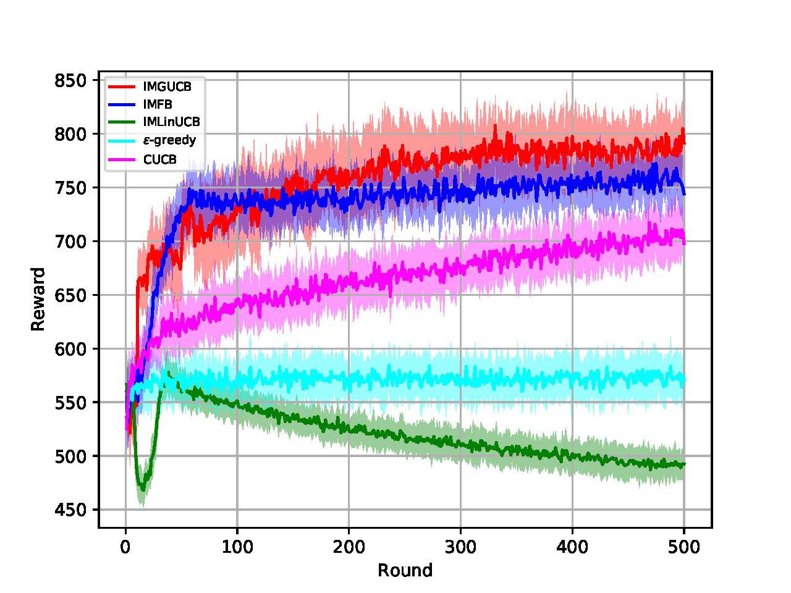
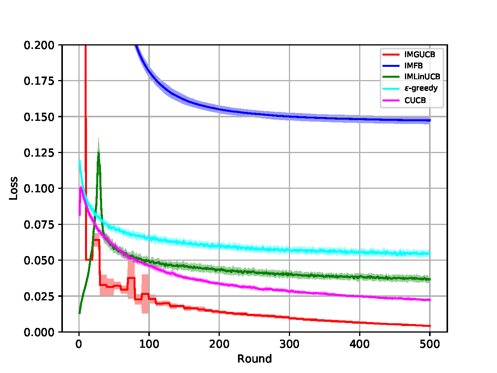
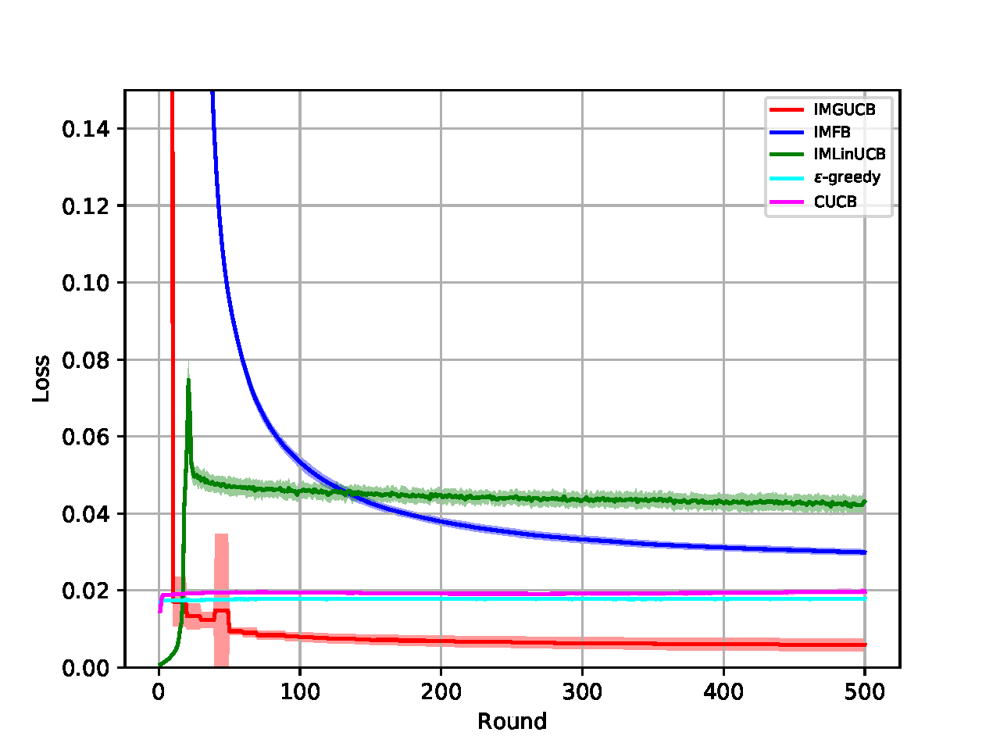
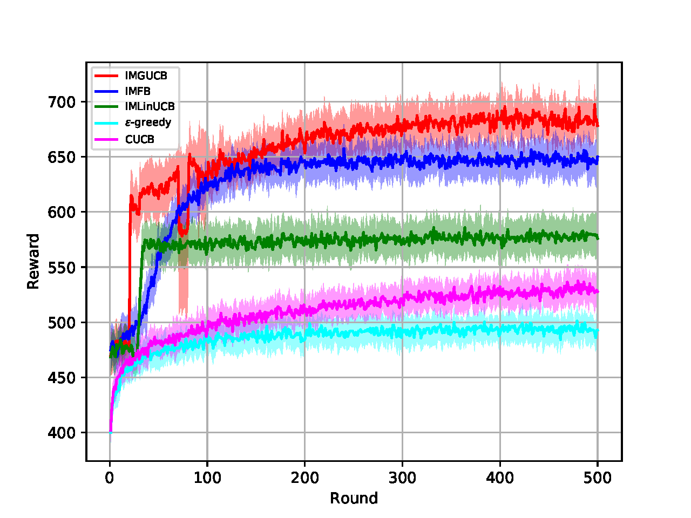
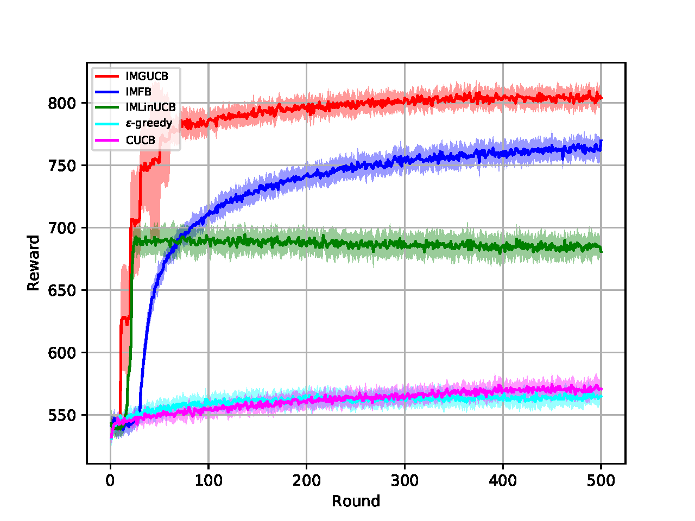

# IMBandits

IMBandit.py -- Simulator. Can run the experiments with command ```python IMBandit.py``` 

BanditAlg -- Baselines for running influence maximization problems.

Oracle/degreeDiscount.py, generalGreedy.py -- Two different oracles (IM algorithm).

conf.py -- The relative parameters used for the experiments. 

SimulationResults -- The folder saved for the results. 

usage example:
```
python IMBandit.py -imgucb -imfb -linucb -egreedy -ucb1 -repeat 5 -dataset Flickr -prob nonlinear -resdir './SimulationResults/nonlinear'
```
#### Parameter

```python
graph_address = './datasets/Flickr/Small_Final_SubG.G'
prob_address = './datasets/Flickr/Probability.dic'
param_address = './datasets/Flickr/Small_nodeFeatures.  dic'
edge_feature_address = './datasets/Flickr/Small_edgeFeatures.dic'
dataset = 'Flickr-Random' #Choose from 'default', 'NetHEPT', 'Flickr'
dataset = 'Flickr' #Choose from 'default', 'NetHEPT', 'Flickr'
alpha_1 = 0.1
alpha_2 = 0.1
lambda_ = 0.4
gamma = 0.1
dimension = 20
seed_size = 300
iterations = 200
oracle = degreeDiscountIAC3
```

#### Experiment

##### Result on Flickr dataset

loss:
<div align="center">
    
    
</div>

reward:
<div align="center">
    
    
</div>

##### Result on NetHEPT dataset

loss:
<div align="center">
    
    
</div>

reward:
<div align="center">
    
    
</div>

#### Acknowledgement:
This implementation references much from https://github.com/Matrix-Factorization-Bandit/IMFB-KDD2019), and we appreciate the authors deeply.